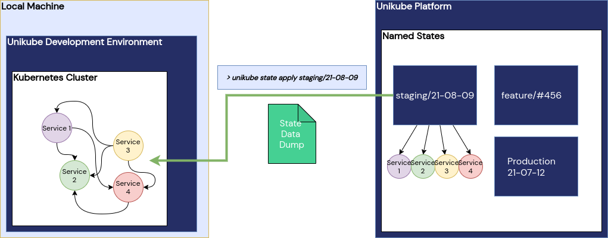

# Named Cluster State

**Summary**  
Restore an entire cluster state with one CLI command. That includes database content, search indexes or simply files on a volume mount. These cluster states are organised and access-managed on the Unikube platform and helpful for a range of applications, for example providing machine learning training data sets, pre-populated databases for application developers and testing with adjacent services.

**Impacted Services**  
- Requires a new service that stores and manages cluster states for projects and/or environments  
- A new CLI command group (such as "state apply <name\>") that pulls a "named state" and installs it to the respective services  

**Description**  
When setting up environments for development or other purposes it becomes very cumbersome to install an initial dataset to a variety of services in a complex mesh. This could be the configuration and test users of an identity provider in a web application with multiple backend clients. Another example would be the state of the staging system in order to hunt bugs that occur only in conjunction of multiple services and data.  
For professional machine learning applications, we see the need to version not only the code that is run to train the model but also the training data itself. A simple command that restores the cluster to a specific version of training data and code will massively improve the process.

In order to simplify this, we're planning to create a feature called "named cluster state".

The idea is quite simple: identify all services with "state" (i. e. databases, indexes, caches, volumes) and put their data in a package. That package is provided with access control on the Unikube platform by an operator.
The Unikube CLI will get a new command group: `state`. Users can then `apply` states to their individual Kubernetes clusters and hence literally set the project environment to a certain state. In order to identify the state, the package will get a name by the operator - hence the "named state".

