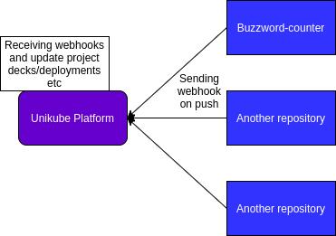

# Git Webhooks

**Summary**

Let unikube platform know about events, that are happening in the repository by triggering 
[git webhooks](https://docs.github.com/en/developers/webhooks-and-events/webhooks/about-webhooks).
For instance, a triggering event could be configured for the push action in the repository. Git webhook
in this case would inform platform about a push to the repository.

**Impacted Services**
- Unikube platform: Creation of webhook endpoint, which would receive git webhook from repository and could
  perform specific actions e.g. synchronizing deployments and decks
- Unikube Docs: Documentation for creation of webhooks in github repository for specific events

Github provides documentation for creation of webhooks for specific repository events.

**Description**  
On receiving the webhook platform could perform similar logic to the logic of the synchronize button, which
is currently available in the platform.

Logic would look like this. Webhooks can be configured in the UI of the github repository. Then, specific
events would trigger webhooks, which would be sent to the platform. Platform performs internal logic after
receiving webhooks e.g. synchronizing decks/deployments.

