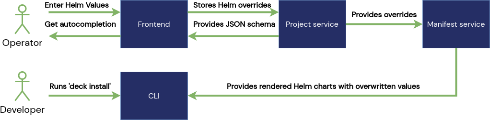

# Helm Overrides

**Executive Summary**

Overwrite [Helm](https://helm.sh/) values with the help of Unikube. Lift the burden of creating
multiple value files or directories for different stages/environments of your cluster.

**Impacted Services**
- Frontend Service - Add YAML editor to enter YAML for helm values. Autocompelete for existing value files
  and directories. We will use the [Monaco Editor](https://microsoft.github.io/monaco-editor/) for that.
  Autocompletion can be achieved via JSON schemas.
- Unikube Commons - Creation of a JSON schema for existing helm value files and directories.
- Project Service - Store JSON schema and overwritten yaml structure.
- Manifest Service - Use new helm values for rendering process.

Unikube offers the creation of dedicated environments for a project.

::: tip
For more information on environments continue here.
:::

For different environment, different helm values may be required to render the
[Helm](https://helm.sh/) charts. Currently this is only possible by creating multiple
value files or value directories within a helm chart repository.

To simplify this we're planning to create feature called "Helm Overrides".

With the help of a frontend code editor the user should be able to create an "overwrite yaml file".
The file then will be used to overwrite helm values in the rendering process for an environment.
The frontend code editor must provide autocompletion for existing helm values.
Our research showed that the [Monaco Editor](https://microsoft.github.io/monaco-editor/) is probably
the best choice for that. It provides autocompletion through JSON schema, which must be generated
from the existing helm value file(s).

