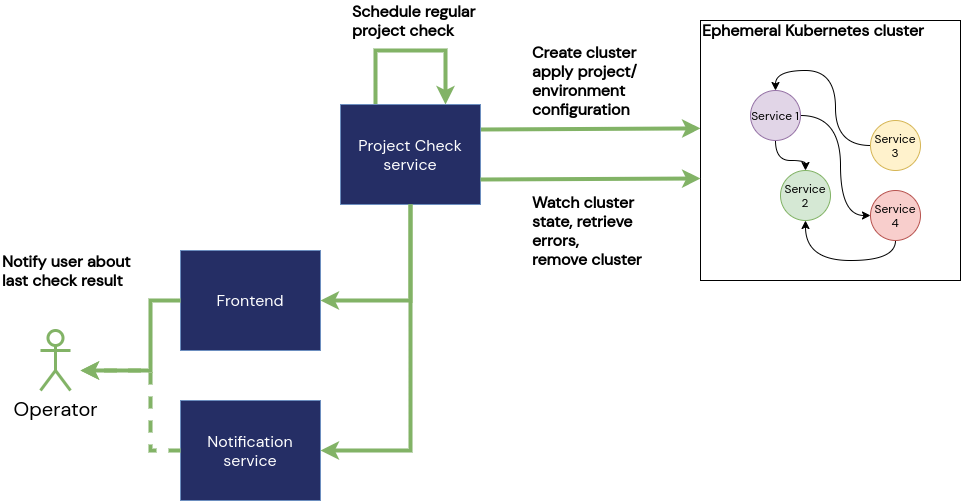

# Health check for projects

**Summary**  
A regular automated check if a project can actually be fully provisioned. There are many different sources for troubles bringing a Kubernetes-environment (some of them are not even in a direct control). A service which checks on a regular basis if a cluster can be succesfully provisioned (from scratch) will increase the robustness and proactively alert if there are sources for malfunctions.

**Impacted Services**  
- Requires a new services that can spin up an ephemeral Kubernetes-cluster, apply the environment configuration (including Helm values, overrides, etc.) and check if all request pods enter the ready state  
- Frontend to display the checks and possible outputs (in case of an error)
- Notification service to message the Unikube users (project admin) about the check result (including error messages)  

Complex projects containing many services are quite hard to maintain.  Especially when many teams control and integrate their parts into an interdependent service mesh. There are many different sources for malfunctions that can only be discovered when trying to provide or upgrade a Kubernetes cluster:  
- is the specified image including the tag available  
- is the pull access (still) valid  
- are application probes working correctly, are they failing under certain circumstances  
- is a correct network policy applied, are there regressions in recent changes  
- does a dependency in an new version cause troubles with volume mount permissions  

Many of those issues can only by uncovered when applying the Kubernetes manifests to a real cluster. They can't be found by "simply" `linting` the manifests. They may be syntactically correct,  but specify an unsatisfiable state. This Unikube feature could reveal quite a lot of those issues.

In order to provide a regular project health overview we're planning to create a feature called "Project Health Check".

A new service "Project check service" as part of the Unikube platform will perform regular checks on registered projects. It will create an emphemeral Kubernetes-cluster (with a configurable/supported Kubernetes-provider) and apply all Decks with their environment configuration. That includes Helm values, overrides and other parameters.  
Once the cluster is up and all manifests applied, the check service will observe the cluster and `pod` states:
- do all pods enter the `ready`state
- are there errors or warnings
- defined ingress routes probe successful
- a few other criterions

After a certain period (i.e. timeout) the Kubernetes cluster will be removed and a corresponding check report generated. The results are then stored in a database to be retrieved by the Frontend and send to the project administrators proactively (if they opted for).
