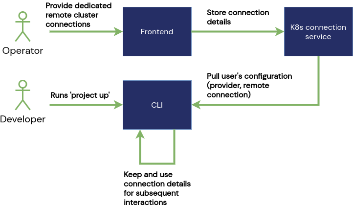

# Remote Cluster Provider

**Summary**  
For larger projects with many services running a local Kubernetes cluster is not feasable anymore. Unikube will support user-based dedicated cluster connection handling for individual remote development clusters. For the CLI user it is not visible wether the cluster is local or remote.

 **Impacted Services**  
- Requires a new services that stores and manages cluster connections  
- Frontend to integrate the connection details for users and environments  
- The CLI pulls connection details upon `project up` and uses it on subsequent cluster interaction  

**Description**  
The Unikube CLI implements a pluggable Kubernetes-provider architecture. It is intended to support all kinds of providers. Currently, [k3d](https://k3d.io/) is the only supported (and default) provider by Unikube's CLI.  
This ensures that each CLI users gets its very own Kubernetes cluster. There are many advantages of having a local development setup: the internet connection can be of bad quality, fast and responsive local IDEs and not to forget about data privacy concerns.
However, large projects with many services simply overwhelm even high-performance computers. In addition, depending less on personal hardware by moving development environments into the cloud is beneficial, too.

In order to support all scenarios we're planning to create a feature called "remote cluster provider".

Since the development setup can be different even within one organisation, Unikube will provide different cluster providers (and connections) based on the selected project. The configuration for the CLI-user is determined upon `project up` and prepared locally. The interface and experience of the CLI will stay the same for all providers in order to hide that complexity from the user.
This feature will be particularly useful in secenarios when multiple team member share the same cluster connection.
